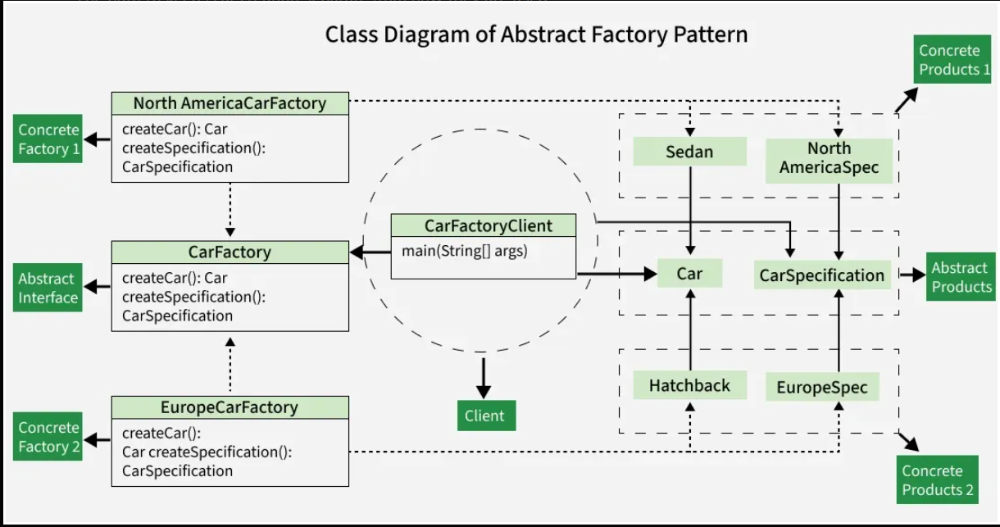

# Abstract Factory

### Definition

* The Abstract Factory is a creational design pattern

* **Main Purpose is:** 
  *   To provide an interface for creating families of related objects without specifying their concrete classes.
  *   To ensure that products from the same family are compatible.
  *   In simple words, it is a factory of factories.
  

### Example

