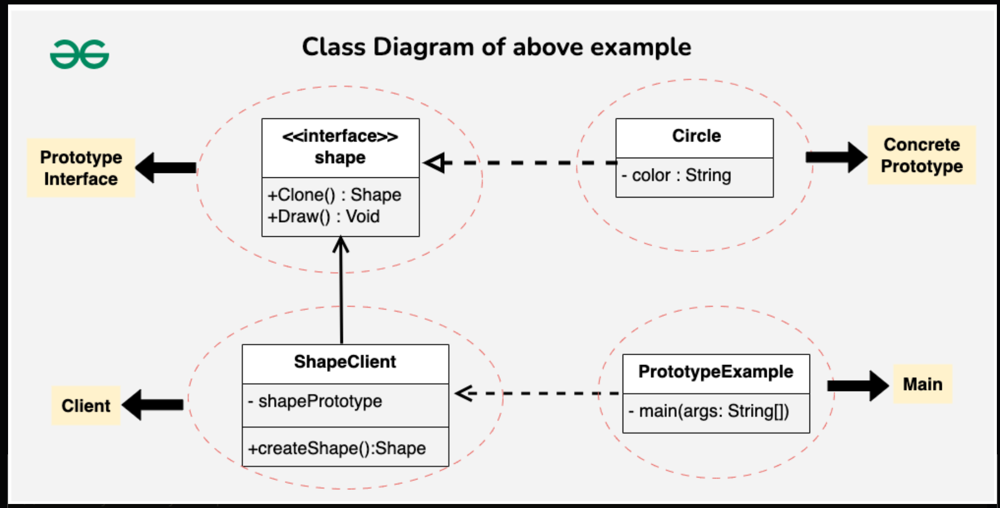
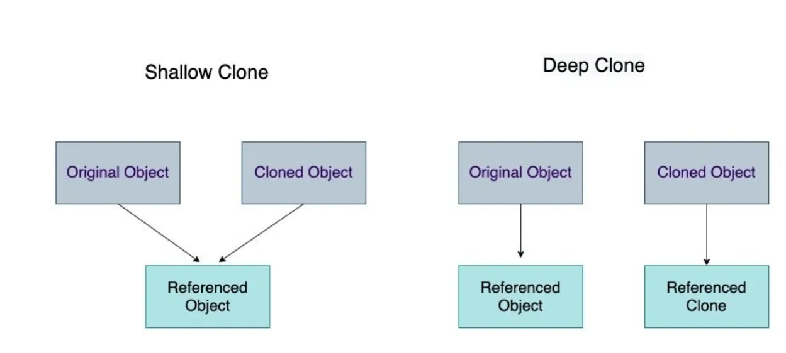

# Prototype 

### Definition

* The CreationalPatterns.Prototype Pattern is a creational design pattern used when creating 
  objects is time-consuming or resource-intensive. Instead of creating new objects
  from scratch, it creates copies of existing objects to improve performance 
  and efficiency.

### Features

* Creates objects by cloning existing instances
* Reduces the need for expensive object initialization
* Uses a clone() method to duplicate objects
* Allows modification of selected properties after cloning

### Components

* **CreationalPatterns.Prototype Interface/Abstract Class:** Defines the clone() method and sets a standard
    for all objects that can be cloned
* **Concrete CreationalPatterns.Prototype** Implements the prototype interface or extends the abstract class
    to provide actual cloning behavior.
* **Client:** Uses the prototype to create new objects by calling the clone() method.
* **Clone Method:** Specifies how an object is copied and is implemented by concrete prototypes.

### Example

### Clone
* There are two types of cloning: Shallow and Deep copy.
* Shallow copy only clones the primitive variables but gives the same reference for object variables.
* Deep copy can also clone the object variables inside the cloning class.
* **PS:** That is why prototype pattern uses the Deep copy.

## That is the explanation of The CreationalPatterns.Prototype Design Pattern by Murat !