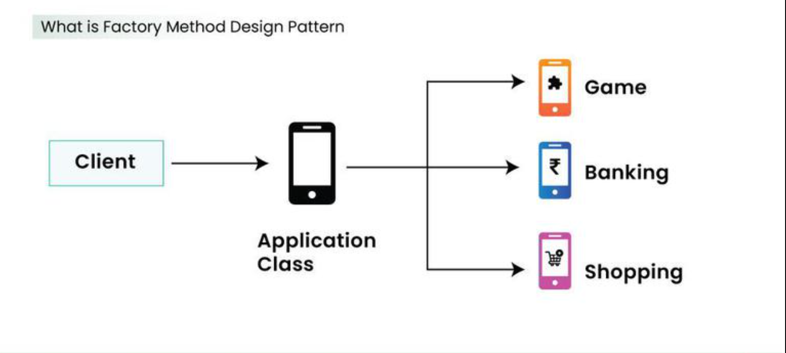

# Factory Method

### Definition
* The Factory Method is a creational design pattern that provides an interface for creating objects in a superclass but allows subclasses to alter the type of objects that will be created.

### Why we use it ?
* **Louse Coupling:** Our code doesn't need to know the specific names of the classes it's working with. It only cares about the interfacae.

* **Single Responsibility Principle:** We can move the product creation code into one place in the program.

* **Open/Closed Principle:** We can introduce new types of products into the program without breaking existing code.

### Example:

### ### That is the explanation of The Factory method design pattern by Murat !