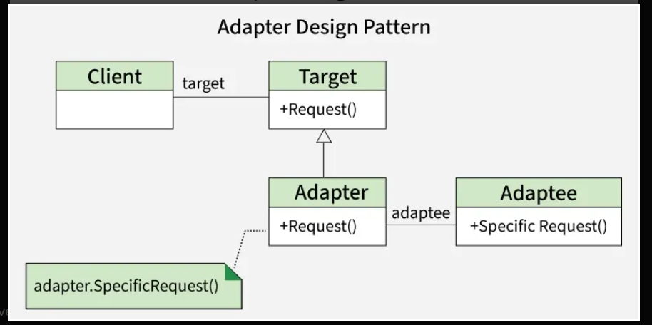

# Adapter

### Defination

* Adapter Design Pattern is a structural pattern that acts as a bridge between two
  incompatible interfaces, allowing them to work together. It is especially useful for 
  integrating code or third-party libraries into a new system.

* It enables classes with incompatible interfaces to collaborate without modifying their source code.
* It promotes code reusability by allowing existing functionality to be used in new systems.
* It can be implemented in two ways: Class Adapter (using interface) and Object Adapter (using composition).

