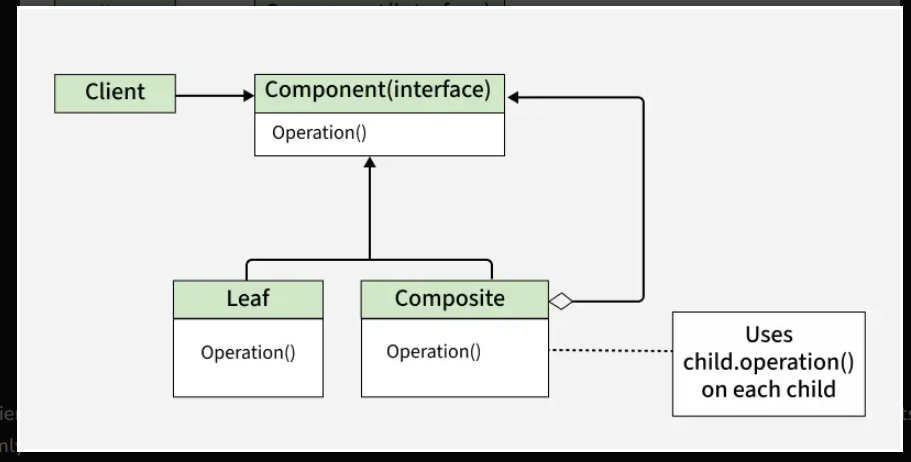

# Composite

### Definition

* The Composite Pattern is a structural design pattern that organizes objects into tree structures,
enabling clients to treat individual and composite objects uniformly through a common interface.

* Allows clients to work with single objects and groups of objects in the same way.

* Simplifies code by using a common interface for both lead and composite objects.

* Makes it easier to add new component types without changing client code

### Real Life Examples
* **Graphics and GUI Libraries:** Building complex graphical structures like shapes and groups.
* **File Systems:** Representing files, directories, and their hierarchical relationships.
* **Organization Structures:** Modeling hierarchical organizational structures like departments, teams and employees.

### Components

* **Component:** The Component is the common interface for all objects in the composition.
  It defines the methods that are common to both leaf and composite objects.

* **Leaf:** The Leaf is the individual object that does not have any children. It implements 
  the component interface and provides the specific functionality for individual objects.

* **Composite:** The Composite is the container object that can hold leaf objects as well as
   the other Composite objects. It implements the Component interface and provides methods
   for adding, removing and accessing children.

* **Client:** The Client is responsible for using the Component interface to work with objects
   in the composition. It treats both Leaf and Composite objects uniformly.