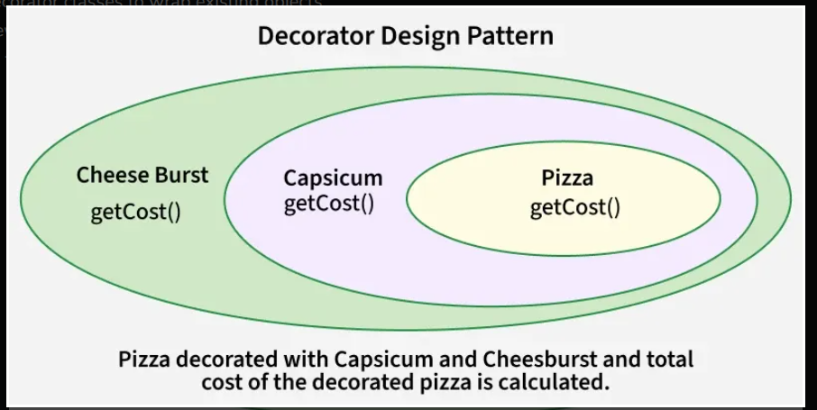
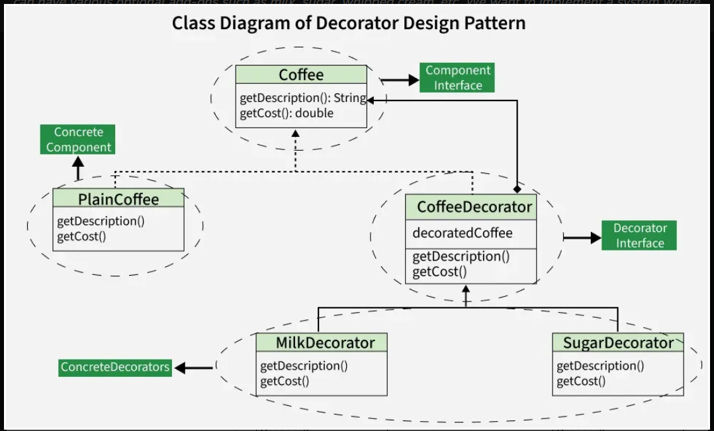

# Decorator

### Definition

* The Decorator Design Pattern is a structural pattern that lets you dynamically add behavior
  to individual objects without changing other objects of the same class. It uses decorator classes
  to wrap concrete components, making functionality more flexible and reusable.

### Components

* **Component Interface:** Defines common operations for components and decorators.

* **Concrete Component:** Core object with basic functionality

* **Decorator:** Abstract wrapper that holds a Component reference and adds behavior
* **Concrete Decorator:** Specific decorates that extend functionality of the component.

### Use cases

* We want to add responsibilities to objects without subclassing, avoiding the need to create multiple derived classes.
* We need to combine behaviors flexibly at runtime, allowing features to be added or removed dynamically as needed.
* We want to extend functionality of a class in a transparent way, without modifying its original code or structure.

