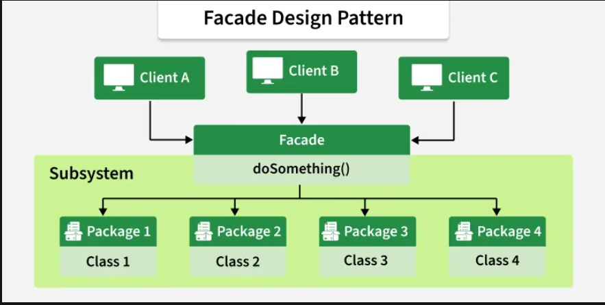

# Facade

### Definition
* The Facade Design Pattern is a structural pattern that provides a simple and unified interface 
  to a complex subsystem. It hides the internal complexity of the system, making it easier to use and maintain.

  
* Structuring a system into subsystems helps reduce overall complexity and improves organization.
  A common design goal is to minimize communication and dependencies between these subsystems.

* The Facade Pattern achieves this by introducing a facade object that acts as a single entry point,
  providing a simplified interface to the underlying subsystem functionality.

### Working

* Client interacts only with the Facade class instead of multiple subsystem classes.

* Facade internally calls the required methods of different subsystems.

* Subsystem classes remain unchanged and unaware of the facade.

* The facade simplifies complex workflows into easy-to-use operations.

### Use cases

* Simplifies interaction with complex external systems such as databases or third-party APIs 
  by hiding internal details.

* Helps in layering subsystems by defining clear boundaries and offering simple interfaces for each layer.

* Provides a single unified interface to multiple or diverse systems, improving usability and consistency.

* Shields client code from changes in internal implementations, reducing dependency and maintenance effort.